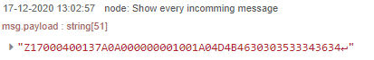
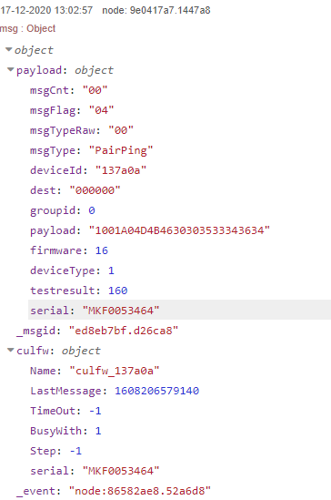
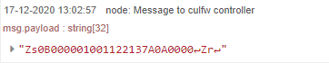
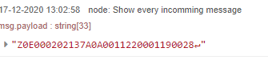
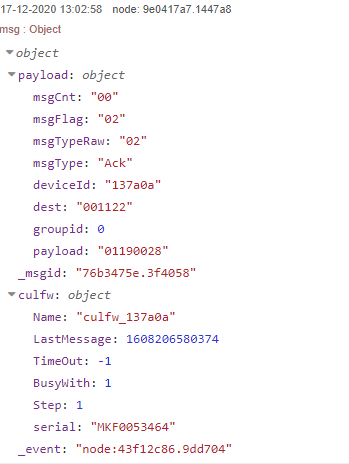

[Goto Readme](README.md)

# Example: Pairing a device

Message flow example for pairing a device

Start pairing a basic+ thermostat.  (Push BOOST button long)

<a id="pairping">
[1. The thermostat sends this message](#pairping)
</a>

Result after parsing:

You see here:

* message type: PairPing
* deviceId:  This is the address of the device
* dest: destination.  000000 is a broadcast address, meaning not paired yet.   

[2. a PairPong message is assembled and send to the device.](#pairpong)

This message is appended with the Zr string, to start receiving again.

[3. The device answers](#ack)

Result after parsing:

If we didn't receive a Ack message, culfw.step would stay at 1.

The device tries a few times to send a PairPing, so at the next PairPing we [start again](Example_pairing.md#pairping) 

