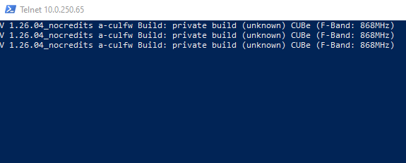
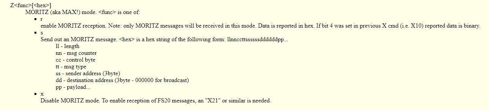
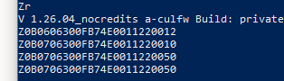

# Introduction

I am using the products from [eQ-3](https://www.eq-3.com) now for 3 years, and they are working very well.
I used to control them from my node-red application by sending messages to the [MAX! Cube Lan gateway](https://www.eq-3.com/products/homematic/detail/max-cube-lan-gateway.html)

Recently i found out about alternative firmware for the Cube.
[culfw](http://culfw.de)
You can run this firmware on a variety of devices, and you are able to control more than only the MAX! devices. (But i think, you need more than 1 culfw device to control different products)

Since i had a MAX! Cube box too much, i decided to flash this with the culfw firmware and start playing with it.
I followed [this guide to flash it](https://community.home-assistant.io/t/converting-a-max-cube-to-cul-cun-to-use-with-home-assistant/74218) with the new firmware.

On the lan, culfw communicates via port 2323.
To test if everything works, start a telnet session.  (on windows: telnet <ipaddress> 2323)
You will see the culfw sends every few seconds a message to announce itself.

[culfw command reference](http://culfw.de/commandref.html)

To work with the MAX! devices, enable MORITZ mode.

 (picture taken from the command reference)

When you send Zr, you start seeing device messages in your telnet session.

To interface this from within node-red, i found these articles very helpfull.

* [only reading and parsing messages](https://github.com/hobbyquaker/cul/blob/master/lib/moritz.js)
* [more complete library](https://gl.petatech.eu/root/HomeBot/-/blob/7afa28792a9ffbb35c9302fa1d174c354883f665/FHEM/14_CUL_MAX.pm)