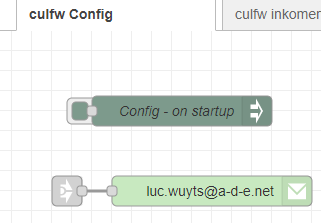
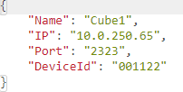

[Goto Readme](/README.md)

# To Know

These flows use following node-red 

node-red-contrib-config
node-red-node-email

Please install them before you can start playing with these flows.

***

During development, i changed the name of some properties.
If you see errors after downloading a new release, please delete all global  culfw_xxxxxx objects from the context.

***
Change your settings.js file, so functions can be stored in memory and reused.
[link to discussion about this](https://discourse.nodered.org/t/use-function-multiple-times/7280/3)

    contextStorage: {
	    default: {
	    	module:"localfilesystem"
	    },
	    memoryOnly: {
	    	module: "memory"
    	}
    },

***

I have setup an extra tab with things you need to change before playing with this flows.

As for the email sending node: you have to use your address and email provider information.

The CONFIG node is executed at the start of the flows.

At this time, only the parameter DeviceId is used.

During testing, i added a message filter. If it still is on in the flow, you can switch this off by changing the filterflag in the source.

I added a function to save unknown messages. You can remove this, or change the file to you liking.
 

