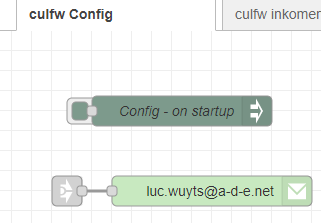
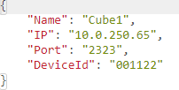

[Goto Readme](README.md)

# To Know

These flows use following node-red 

node-red-contrib-config
node-red-node-email

Please install them before you can start playing with these flows.

***

I have setup an extra tab with things you need to change before playing with this flows.

As for the email sending node: you have to use your address and email provider information.

The CONFIG node is executed at the start of the flows.

At this time, only the parameter DeviceId is used.

